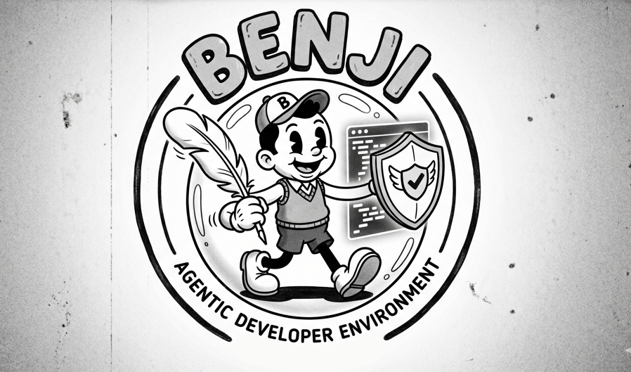

<p align="center">
  
</p>

# Experiment - Project Benji

> **WARNING: This project is experimental and in alpha. It is NOT ready for production use. Do not use this for production agentic development workflows. Expect breaking changes, incomplete features, and rough edges.**

Credential-isolated ECS-based development environments for running LLM agents (Claude Code) against multi-account AWS infrastructure.

The core security property: **no credentials exist inside the agent container**. All GitHub and Google Cloud authentication is handled at the network layer by a TLS-intercepting egress proxy; AWS credentials are IP-bound STS sessions that are useless from any other IP.

## Components

- **Egress Proxy** (`egress-proxy/`) — Go TLS-terminating MITM forward proxy. Runs as a Fargate task per session. Injects GitHub PAT and Google OAuth2 tokens into proxied requests. Enforces a compiled domain allowlist.

- **Agent Environment** (`agent-env/`) — UBI9 container on an EC2 capacity provider (privileged mode for podman). Developer's working environment with Claude CLI, git, gh, aws-cli, podman. All HTTPS traffic routes through the paired proxy.

- **Provisioning Service** (`agent-env/provisioner/`) — API Gateway + Lambda (Python) that orchestrates environment lifecycle. The sole credential minter — reads raw secrets from Secrets Manager, creates IP-bound STS sessions, injects them into the agent container via ECS Exec.

## Quick Start

```bash
# Build all container images
make images-build

# Push to ECR
make images-push

# Deploy shared infrastructure
make infra-deploy

# Create an environment
make env-create

# Shell in
make env-shell ID=<env-id>

# Tear down
make env-destroy ID=<env-id>
```

See [CLAUDE.md](CLAUDE.md) for full development workflow and architecture details.
