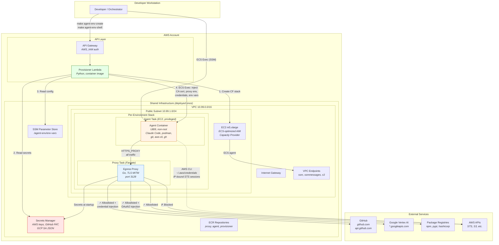

# Agent VM Isolation — Architecture

## Overview

Credential-isolated development environments for running LLM agents (Claude Code) with access to multi-account AWS infrastructure, GitHub, and Google Cloud. The core security property: **no credentials exist inside the agent container**. All authentication is handled at the network layer by a TLS-intercepting egress proxy.

## Infrastructure Diagram



## Component Details

### Shared Infrastructure (CloudFormation: `agent-shared-infra`)

Deployed once per region. Contains all long-lived resources:

| Component | Purpose |
|---|---|
| VPC + Subnet | Isolated network, single public subnet |
| ECS Cluster | `agent-vm-isolation`, Container Insights disabled |
| EC2 ASG + Capacity Provider | Single m5.xlarge for agent tasks (EC2 launch type for privileged containers) |
| Fargate | For proxy tasks (no privileged needed) |
| ECR | Three repos: `agent-egress-proxy`, `agent-env`, `agent-provisioner` |
| Secrets Manager | 9 secrets: 7 AWS credentials (3 accounts), GitHub PAT, GCP SA JSON |
| SSM Parameter Store | `/agent-env/env-vars` — non-secret agent configuration |
| API Gateway | REST API with AWS_IAM auth, routes to provisioner Lambda |
| Provisioner Lambda | Container-image Lambda (UBI9 + awslambdaric), orchestrates environment lifecycle |
| VPC Endpoints | `ssm`, `ssmmessages` (Interface), `s3` (Gateway) — ECS Exec without public endpoints |
| Security Groups | Strict separation: agent→proxy only, proxy→internet HTTPS only |

### Per-Environment Stack (CloudFormation: `agent-env-{id}`)

Created per developer session, contains a paired proxy + agent:

| Component | Launch Type | CPU/Mem | Network |
|---|---|---|---|
| Egress Proxy | Fargate | 512/1024 | Own ENI, public IP, proxy SG |
| Agent Container | EC2 (privileged) | 2048/8192 | Own ENI, no public IP, agent SG |

## Security Architecture

### Credential Flow

```
┌─────────────────────────────────────────────────────────────┐
│ Provisioner Lambda (sole credential minter)                 │
│                                                             │
│  1. Read raw IAM keys from Secrets Manager                  │
│  2. Discover agent egress IP (EC2 host public IP)           │
│  3. Create IP-bound STS sessions (12h TTL):                 │
│     - Central: AssumeRole with IP policy                    │
│     - Regional: GetSessionToken with IP policy              │
│     - Management: GetSessionToken with IP policy            │
│  4. ECS Exec → write ~/.aws/credentials into agent          │
│                                                             │
│  IP restriction policy:                                     │
│  {"Effect":"Deny","Action":"*","Resource":"*",              │
│   "Condition":{"NotIpAddress":{"aws:SourceIp":"x.x.x.x"}}} │
└─────────────────────────────────────────────────────────────┘
```

### Egress Proxy — Credential Injection

The proxy performs TLS MITM on all HTTPS traffic from the agent. Credentials never exist in the agent container for proxied services:

| Destination | Auth Method | Injected By Proxy |
|---|---|---|
| `github.com` | Basic auth (`x-access-token:TOKEN`) | GitHub PAT from Secrets Manager |
| `api.github.com`, `codeload.github.com` | `Authorization: Bearer TOKEN` | GitHub PAT from Secrets Manager |
| `*.googleapis.com` | `Authorization: Bearer TOKEN` | OAuth2 token from GCP SA JSON (auto-refreshed) |
| Everything else | None | Passed through |

### Egress Proxy — Domain Allowlist

All non-allowlisted destinations return HTTP 403. The allowlist is compiled into the proxy binary:

| Category | Domains |
|---|---|
| GitHub | `github.com`, `api.github.com`, `codeload.github.com`, `cli.github.com`, `*.githubusercontent.com` |
| Google Cloud | `*.googleapis.com` |
| AWS | `*.amazonaws.com` |
| Package registries | `registry.npmjs.org`, `pypi.org`, `files.pythonhosted.org`, `*.pythonhosted.org`, `astral.sh`, `*.astral.sh` |
| Container registries | `*.redhat.com`, `*.quay.io` |
| Tools | `get.helm.sh`, `*.azurefd.net`, `dl.k8s.io`, `*.dl.k8s.io`, `*.hashicorp.com`, `mirror.openshift.com` |

### Network Segmentation

```
Agent SG (agent-task-sg)
  Egress: → Proxy SG port 3128 (HTTPS proxy)
           → VPC CIDR port 53 (DNS)
           → 0.0.0.0/0 port 443 (AWS API endpoints via VPC endpoints + STS)

Proxy SG (agent-proxy-sg)
  Ingress: ← Agent SG port 3128
  Egress:  → 0.0.0.0/0 port 443 (upstream HTTPS)
            → VPC CIDR port 53 (DNS)

EC2 Host SG (agent-ec2-host-sg)
  Egress: → 0.0.0.0/0 (all, for ECS agent + image pulls)
```

### Container Security

- Agent runs as non-root user (`agent`, UID 1000)
- `Privileged: true` required for rootless podman (fuse-overlayfs)
- ECS Exec sessions connect as root (AWS limitation), `make agent-env-shell` drops to `agent` via `su`
- Proxy CA cert installed at build time path, refreshed during provisioning via `/ca.crt` HTTP endpoint

## Provisioning Flow

```
make agent-env-create
  │
  ├─ 1. POST /environments → Lambda creates CF stack (agent-env-{id})
  │     └─ Stack creates: proxy task def + service, agent task def + service
  │
  ├─ 2. Poll GET /environments/{id} until status=ready
  │     └─ Waits for both ECS services to have running tasks
  │
  └─ 3. POST /environments/{id}/provision → Lambda provisions the agent:
        ├─ a. Wait for ECS Exec agent readiness (retry loop, up to 120s)
        ├─ b. Mint IP-bound STS credentials (if secrets populated)
        ├─ c. Fetch proxy CA cert into agent trust store (curl from proxy /ca.crt)
        ├─ d. Configure HTTPS_PROXY env vars in agent .bashrc
        └─ e. Inject env vars from SSM /agent-env/env-vars into agent .bashrc
```

## Known Limitations

- **Single EC2 host**: One m5.xlarge, one agent environment at a time (PoC constraint)
- **No persistent storage**: Agent workspace is ephemeral; work must be committed to git
- **ECS Exec latency**: SSM agent takes 15-30s to initialize after task start
- **Credential exfiltration**: Agent can exfiltrate via allowed domains (e.g., push to attacker's GitHub repo). Mitigated by repo-scoped tokens (future)
- **Privileged container**: Required for podman, enables root escalation. Mitigated by running as non-root user
- **Static allowlist**: Compiled into proxy binary, requires rebuild to change
